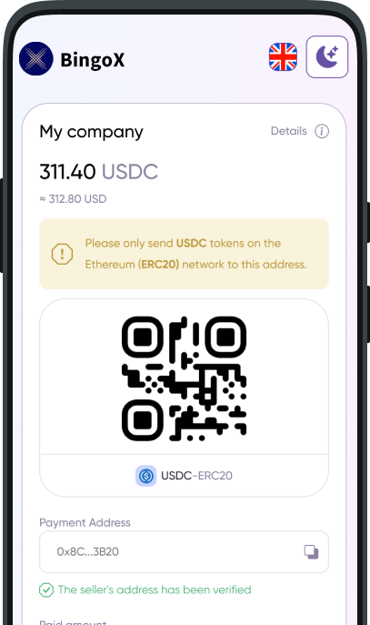
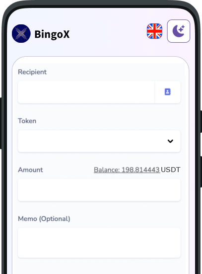

# BingoXPOC(Pay On Smart Chain) Gateway API Quick Start

# Gaming industry 

## Preparation

First of all, you should make an enrollment of your application in an POC-compatible system to get the corresponding App ID & App Key, and setup the notify URL of your system backend service.

### Common payment workflow of your system

- 1. Get or create a `dedicated wallet` for each of your users by calling POC API.

The user's ID/email/username is required to create wallet to make sure that the user has one and only one dedicated wallet for himself or herself.

**Example:**
```js
const str = util.filterAndConcat(util.sortArray({out_user_id: loginUser.userID, out_user_email: loginUser.email, out_user_name: loginUser.username}));
const sign = md5(str) + appKey;
const res = api.createTokenWallet(loginUser.userID, loginUser.email, loginUser.username);
User.update({walletAddress: res.wallet_address},{userID: loginUser.userID});
```

- 2. Show the user's dedecated `wallet address` (generally with it's `QR Code` provided by your system) in the order payment UI within your system. It something like:





The user can scan the QR Code, or copy the wallet address to send the accurate number of tokens to it. The transaction is totally on chain, you can find it on an block explorer, like TRONSCAN.


**Example:**
```js
const order = sys.createOrder();
if(!loginUser.wallet_address){
    const str = util.filterAndConcat(util.sortArray({out_user_id: loginUser.userID, out_user_email: loginUser.email, out_user_name: loginUser.username}));
    const sign = md5(str) + appKey;
    const res = api.createTokenWallet(loginUser.userID, loginUser.email, loginUser.username, sign);
    User.update({walletAddress: res.wallet_address},{userID: loginUser.userID});
    loginUser.wallet_address = res.wallet_address;
}
const qrCodeURL = sys.generateQRCode(loginUser.wallet_address);
return {walletAddress: walletAddress, qrCodeURL: qrCodeURL, totalAmount: orderTotalAmount, orderID: order.orderID};
```


- 3. Receive payment notification from POC, then complete the whole payment progress.

After the payment confirmed with blocks, POC will push the block chain transaction information to your system via the `notify URL`.

Here is a very practical `strategy` to handle the notification. In case of some sender's wallet might have sent an inaccurate number of tokens, an `auto-topup` into the user's balance account with the received token number is recommended. Another hand, set the `payment status` of the matched order with the same amount COMPLETED, while receiving the accurate number of tokens.

After successful processing, you need to response a string `'SUCCESS'` to the POC gateway, otherwise the gateway will keep pushing notification repeatedly.

**Example:**
```js
const posts = request.post();//all posted key-values

//validate signature
const argsWithoutSign = unsetSign(posts);
const str = util.filterAndConcat(util.sortArray(argsWithoutSign));
const sign = md5(str) + appKey;
if(sign!=posts.sign){
    return 'Invalid signature';
}

if(posts.notify_type==1){//order payment
    const user = User.find({wallet_address: posts.wallet_address});
    const order = Order.findByAmount({userID: user.UserID, totalAmount: posts.amount, expired: false})
    if(order){
        //order logic after paid
        order.afterPaid(posts.txid);
    }else{
        //add user's system balance
        Topup.addUserBalance(user.userID, posts.txid, posts.amount);
    }
    return 'SUCCESS';
}else if(posts.notify_type==2){//withrawal
    // more details in the 'withdrawal' document section
    ... ...
}
```

### Common withdrawal workflow of your system

- 1. In your system, users submit withdrawal bills, including amount and recipient's wallet address.



You decide whether to pay the amount of money to the user or not.

- 2. Your system operator (or a robot) reviews the bills, then call the corresponding POC API to let POC transfer tokens to the recipient's wallet address.

Create an wallet for the user when (s)he is fresh. The transaction is totally on chain, you can find it on an block explorer, like TRONSCAN.


**Example:**
```js
// get user's wallet address
if(!withdrawUser.wallet_address){
    const str = util.filterAndConcat(util.sortArray({out_user_id: withdrawUser.userID, out_user_email: withdrawUser.email, out_user_name: withdrawUser.username}));
    const sign = md5(str) + appKey;
    const res = api.createTokenWallet(withdrawUser.userID, withdrawUser.email, withdrawUser.username, sign);
    User.update({walletAddress: res.wallet_address},{userID: withdrawUser.userID});
    withdrawUser.wallet_address = res.wallet_address;
}

// make a bill
const bill = sys.createWithdrawalBill(recipientAddress, amount);

// call withdrawal api
const to_wallet_address = recipientAddress;
const out_trade_no = bill.billCode; // must be unique
const pin = request.post('pin');
const str = util.filterAndConcat(util.sortArray({to_wallet_address,amount,out_trade_no,pin}));
const sign = md5(str) + appKey;
const res = api.submitTokenWithdraw(to_wallet_address,amount,out_trade_no,pin, sign);
// save the txid
Bill.update({txid: res.txid},{id: bill.id});
```

- 3. Receive withdrawal notification from POC, then complete the whole payment progress.

After the payment confirmed with blocks, POC will push the block chain transaction information to your system via the `notify URL`.

After successful processing, you need to response a string `'SUCCESS'` to the POC gateway, otherwise the gateway will keep pushing notification repeatedly.

**Example:**
```js
const posts = req.body;

//validate signature
const argsWithoutSign = unsetSign(posts);
const str = util.filterAndConcat(util.sortArray(argsWithoutSign));
const sign = md5(str) + appKey;
if(sign!=posts.sign){
    return 'Invalid signature';
}

if(posts.notify_type==1){//order payment
// more details in the 'order payment' document section
    ... ...

}else if(posts.notify_type==2){//withrawal
    const billCode = posts.out_trade_node;
    const bill = Bill.findByCode(billCode);
    const withdrawal = Withdrawal.findByPK(bill.withdrawalID);
    //withdrawal logic after recipient got the tokens
    withdrawal.afterPaid(posts.txid);
}
```

## Gateway base uri

- sandbox

https://sandbox.payonchain.org/V2/

- production

https://open.payonchain.org/V2/

## API references

### createTokenWallet

- Method: POST

- Content-type: application/json;charset=UTF-8

- Post Fields

| Name    | Data Type | Remark |
| -------- | ------- | ------- |
| out_user_id    | string    | required. unique. |
| out_user_email    | string    | optional.    |
| out_user_name    | string    | optional.    |
| app_id  | string    | required.    |
| sign | string     | required.     |
| | | |

- Response

| Name    | Data Type |
| -------- | ------- |
| code    | string    |
| msg    | string    |
| sub_code    | string    |
| sub_msg    | string    |
| data    | object    |
| | |

**Data in Response:**

| Name    | Data Type | Remark |
| -------- | ------- | ------- |
| wallet_address| string | required.|
| is_new| boolean| optional.|
| | | |


### submitTokenWithdraw


- Method: POST

- Content-type: application/json;charset=UTF-8

- Post Fields

| Name    | Data Type | Remark |
| -------- | ------- | ------- |
| out_trade_no    | string    | required. unique.   |
| to_wallet_address    | string    | required. The recipient's wallet address.|
| amount    | decimal(15,2)    | required.    |
| pin    | string    | required. The merchant's PIN, not the user's PIN.   |
| app_id  | string    | required.    |
| sign | string     | required.     |
| | | |

- Response

| Name    | Data Type |
| -------- | ------- |
| code    | string    |
| msg    | string    |
| sub_code    | string    |
| sub_msg    | string    |
| data    | object    |
| | |

**Data in Response:**

| Name    | Data Type | Remark |
| -------- | ------- | ------- |
| txid| string | optional. It might be null while the block chain network is busy. The transaction will be postpone-submitted in this case.|
| | | |


## Error codes

| code    | msg | sub_code | sub_msg |
| -------- | ------- | ------- | ------- |
| 10000    | Success    | | |
| 40001    | Illegal argument    |isv.invalid-*|***|
| 40002    | No data    |isv.nodata-*|***|
| 40003    | Exception    |isv.db-operation-failed|***|
| 40004    | Integrity violation    |***|***|
| 40006    | Rejected    |***|***|
| 40005    | Access denied    |isv.access-denied|***|
| 40007    | Service suspended    |isv.merchant-lack-of-advance-balance|***|
| 40008    | Out of range    |***|***|
| 40009    | Not Found    |***|***|
| | |

